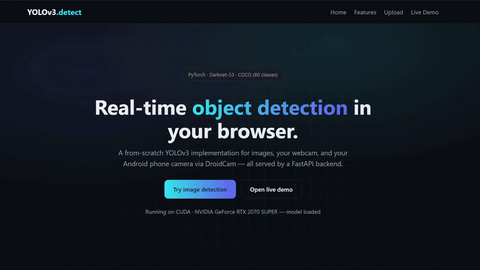

# YOLOv3 Object Detection (PyTorch) — WSL + DroidCam

A from-scratch PyTorch implementation of YOLOv3 (Darknet53) for static images,
offline videos, and real-time detection from your **Android phone camera via
DroidCam** — all inside WSL2 with GPU (CUDA) support.



## Features

- YOLOv3 COCO pre-trained (80 classes), 3-scale detection (13x13 / 26x26 / 52x52).
- Static image detection with bounding boxes, class labels, confidence.
- Offline video detection (`outputs/<name>_detected.mp4`).
- Real-time detection from DroidCam's HTTP/MJPEG phone stream (no `/dev/video*`
  needed — WSL2 has no v4l2/USB camera drivers).
- Automatic display: a live resizable window with boxes, class labels, and
  confidences when WSLg is available; headless console log + frame saving if not.
  (Uses the GUI-enabled `opencv-python` package — `--no-display` forces headless.)
- CUDA auto-detected; falls back to CPU. Optional FP16 on GPU.

## Requirements (WSL)

- Ubuntu WSL2 (GUI optional: WSLg for a live window).
- NVIDIA GPU + driver inside WSL (`nvidia-smi` should work).
- Conda env or system Python 3.9+.

## Quick start

```bash
# 1. (recommended) create/activate a conda env
conda create -n objdetc python=3.10 -y
conda activate objdetc

# 2. install dependencies (installs CUDA-enabled torch wheels on Linux)
pip install -r requirements.txt

# 3. download pre-trained YOLOv3 weights + cfg (~248 MB)
python download_weights.py

# 4. test on an image
python detect.py --image data/sample.jpg --conf 0.5
#   -> outputs/sample_detected.jpg
```

Verify GPU is used: the scripts print `Device: cuda (CUDA)`. To double-check:

```bash
python -c "import torch; print(torch.cuda.is_available(), torch.cuda.get_device_name(0))"
```

## Detect on a video file

```bash
python detect.py --video data/sample.mp4 --conf 0.5
#   -> outputs/sample_detected.mp4
```

Useful flags:

| Flag | Meaning |
|---|---|
| `--conf 0.5` | confidence threshold (lower = more detections) |
| `--iou 0.45` | NMS IoU threshold |
| `--img-size 416` | YOLO input size (416/512/608) |
| `--fps-skip 2` | process every 2nd video frame for speed |
| `--half` | FP16 inference on GPU |
| `--cpu` | force CPU |

## Real-time detection with your phone (DroidCam)

DroidCam exposes an HTTP/MJPEG stream (`http://<phone-ip>:4747/video`) that
OpenCV reads directly. The DroidCam desktop client's virtual `/dev/video*`
device is **not visible inside WSL2** (no camera drivers in the WSL kernel), so
we skip the desktop client entirely and stream over WiFi.

1. Install the **DroidCam app** on your Android phone (and iOS works too).
2. Connect the phone and PC to the **same WiFi network**.
3. Open the DroidCam app — note the **IP & Port** it shows (default port 4747).
4. (Optional) Verify the stream in a browser: `http://<phone-ip>:4747/video`.
5. Close the DroidCam desktop client if it is running — **only one client may
   connect to the phone at a time**.
6. Run:

```bash
python live_detect.py --ip <phone-ip> --conf 0.5 --res 640x480
```

- `--res 640x480` optionally asks the stream for a specific size
  (`.../video/force/WxH`); omit for the phone's default.
- A resizable **live window** opens (WSLg) showing boxes + class labels +
  confidences + FPS; press **q** to quit. Add `--no-display` to disable it.
- Headless fallback prints per-frame detections + FPS to the console.
- `--save-every 30` saves an annotated frame every 30th frame to `outputs/`.

Play a local video in the same live viewer:

```bash
python live_detect.py --video data/sample.mp4 --conf 0.5
```

## Project layout

```
├── requirements.txt        # dependencies
├── download_weights.py     # fetches yolov3.weights + yolov3.cfg
├── detect.py               # offline image / video CLI
├── live_detect.py          # real-time DroidCam / video CLI
├── run_web.py              # FastAPI web app entrypoint
├── web/                    # web app (main, routes, live WS, static frontend)
├── weights/                # pre-trained weights + cfg
├── data/                   # sample input images / videos
├── outputs/                # saved detection results
└── src/
    ├── model.py            # cfg parser, Darknet53, .weights loader
    └── utils.py            # letterbox, decode, NMS, COCO names, drawing
```

## Web app

A FastAPI web interface with a landing page, image upload detection, and live
detection (browser webcam or DroidCam phone stream).

```bash
pip install -r requirements.txt       # installs fastapi + uvicorn too
python run_web.py                     # http://localhost:8000
```

- **Image detection** — upload an image, get annotated boxes + detection list.
- **Live demo** — use your webcam (streamed over WebSockets) or connect to a
  DroidCam phone camera by IP/port.
- `GET /api/health` reports device (CUDA/CPU) and model load status.

## Troubleshooting

- **No CUDA / device is cpu**: torch was built for CPU; `pip install torch torchvision`
  on Linux installs CUDA-enabled wheels. Verify with `torch.cuda.is_available()`.
- **Stream opens but no window**: missing WSLg or a headless OpenCV build.
  Reinstall the GUI build: `pip uninstall opencv-python-headless -y && pip install opencv-python`.
  If still headless, run with `--no-display` (frames print in console, or `--save-every`).
- **"Connect failed"**: phone and PC on the same network, DroidCam app running,
  and confirm the IP/port from the app. Only one DroidCam client allowed.
- **Low FPS on CPU**: use `--half` only helps on GPU; lower `--img-size` to 320.
